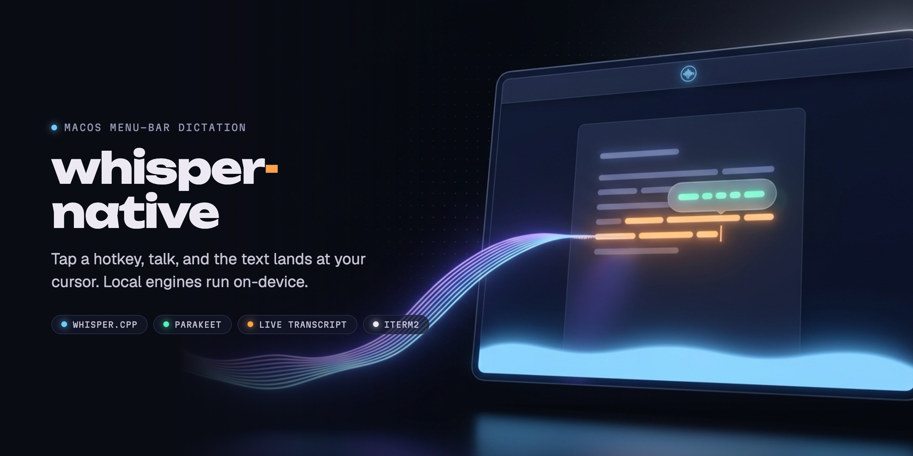

<p align="center">
  
</p>

<p align="center">
  <b>Menu-bar dictation for macOS. Tap a hotkey, talk, and the text lands at your cursor.</b><br>
  The local engines (whisper.cpp and Parakeet) run on your Mac. An optional Gemini engine runs in the cloud.
</p>

<p align="center">
  
  
  
</p>

<p align="center">
  <a href="docs/media/whisper-native-promo.mp4"></a>
  <br><sub>15-second tour. <a href="docs/media/whisper-native-promo.mp4">MP4 version</a>. The demo is an animated mock of the app's real UI.</sub>
</p>

## How it works

whisper-native lives in the menu bar as a background agent, with no Dock icon.
Tap Fn (or any shortcut you pick) and it starts recording. A soft blue glow at
the bottom of the screen pulses with your voice. Tap again and the
transcription is pasted at the cursor of whatever app has focus, terminals
included.

The whisper.cpp engine runs as a warm `launchd` daemon that stays up between
dictations, so the model is already loaded when you press the key. With
the Parakeet engine, a small pill next to the cursor shows the transcript
while you are still talking.

## Engines and privacy

Pick the engine in Settings > General.

| Engine | Where it runs | First download | Notes |
|--------|---------------|----------------|-------|
| whisper.cpp `large-v3-turbo` (default) | On your Mac, warm `launchd` daemon | ~1.6 GB | Any of whisper.cpp's ~100 languages, plus auto-detect. Smaller models on the Whisper settings page |
| Parakeet TDT v3 | On your Mac, in-process via FluidAudio | ~500 MB | Faster, with a live transcript pill while you talk |
| Gemini (experimental, optional) | **Cloud: your audio is sent to Google** | none | Needs your own Gemini API key, stored in the macOS Keychain. Gemini Live also shows the live pill |

With whisper.cpp or Parakeet, audio and text stay on your Mac and dictation
works offline once the model is downloaded. Gemini is off unless you pick it
and enter a key.

## Features

- First-run setup guide (engine, model download, permissions, hotkeys, language), skippable and reopenable from the menu bar
- Toggle hotkey: tap a lone modifier (Fn by default) or any shortcut
- Language cycling (Option+Tab) through the languages you pick; the menu bar shows the current language code
- Live transcript pill while recording (Parakeet and Gemini Live)
- Optional auto-start when you speak, and an optional stop word that ends the recording when you say it (engines with a live transcript)
- Custom vocabulary and stop words in a `words.yml` file
- Filler-word removal (uh, hmm, um)
- Optional line wrapping / sentence-per-line output
- Transcription history
- iTerm2 integration: text goes to the session you started recording in, with optional auto-submit

## Install

Download the latest `.dmg` from
[Releases](https://github.com/Binary-Gap/whisper-native/releases), open it, and
drag WhisperNative into Applications.

Or via Homebrew:

```sh
brew install --cask binary-gap/tap/whisper-native
```

**Requirements:** Apple Silicon, macOS 26 (Tahoe) or later.

The app checks for updates once a day (from 0.3.0 on) and offers them in the
menu bar menu; Settings > General > Updates can install them automatically.

The app needs Microphone access (to record) and Accessibility access (to
paste the transcribed text via a synthesized Cmd+V). macOS will prompt for
both on first use.

## First run

Models download the first time each engine is used. The whisper engine (the
default) asks before downloading the recommended `large-v3-turbo` (~1.6 GB)
into `~/Library/Application Support/whisper-native/models/`; smaller models
are on the Whisper settings page. If you switch to Parakeet, it downloads
~500 MB into `~/Library/Application Support/FluidAudio/Models`. Grant the
Microphone and Accessibility prompts when macOS shows them.

If you rebuild the app with a different code signature (for example
switching between a Debug build and your own signed build), macOS treats it
as a different app for permissions purposes even though the bundle ID is the
same. Paste will silently stop working; reset and re-grant Accessibility:

```sh
tccutil reset Accessibility io.binarygap.whisper-native
```

## iTerm2 (optional)

Out of the box, dictation into iTerm2 uses the same Cmd+V paste as any other
app. The iTerm2 integration sends the text straight to the session you
started recording in (even if you switch windows while it transcribes) and
can press Enter for you (Settings > Output > "Auto-submit in
terminal"). It talks to iTerm2's Python API, so it needs:

1. iTerm2 > Settings > General > Magic > **Enable Python API**.
2. The `iterm2` Python package in the interpreter the app uses: `python3`
   from [mise](https://mise.jdx.dev) if installed, else `/usr/bin/python3`:

   ```sh
   python3 -m pip install --user iterm2
   ```

If either is missing, the app falls back to paste.

## Build from source

Requirements:

- macOS 26 or later
- Xcode 26 or later
- [mise](https://mise.jdx.dev)
- [xcodegen](https://github.com/yonaskolb/XcodeGen)
- cmake (needed to build the bundled whisper.cpp server)

```sh
# First time, or after adding/moving source files
mise run generate

# Build (also clones and builds whisper.cpp into external/ on first run)
mise run build

# Launch
mise run run

# Run tests
mise run test
```

If `cmake` fails with a "tapi error: malformed file" during the whisper.cpp
build, it picked up the wrong SDK; prefix the build with
`SDKROOT=$(xcrun --sdk macosx --show-sdk-path)`.

For a signed build, create a gitignored `mise.local.toml`:

```toml
[env]
APPLE_TEAM_ID = "YOUR_TEAM_ID"
DEBUG_SIGN_IDENTITY = "Apple Development"
```

## Architecture

Two targets: `WhisperNative` (the menu-bar app: hotkeys, settings, app
lifecycle) and `WhisperNativeCore` (a framework holding everything else).
Pipeline: a hotkey press starts the audio recorder, which hands the recording
to a transcription backend (whisper.cpp, Parakeet or Gemini), whose output goes
through a text inserter that pastes it at the cursor. See `CLAUDE.md` for
the full module map.

## Uninstall

Quitting the app boots the whisper-server daemon out of `launchd`. Removing
the app from Applications is enough for most cases.

If you installed via Homebrew and also want to remove models, logs and
settings:

```sh
brew uninstall --zap --cask whisper-native
```

Or by hand:

- `~/Library/Application Support/whisper-native`
- `~/Library/Application Support/FluidAudio`
- `~/Library/Logs/whisper-native`
- `~/Library/LaunchAgents/io.binarygap.whisper-server.plist`
- `~/Library/Preferences/io.binarygap.whisper-native.plist`

## License

MIT, see LICENSE. Third-party licenses in THIRD_PARTY_NOTICES.md.
